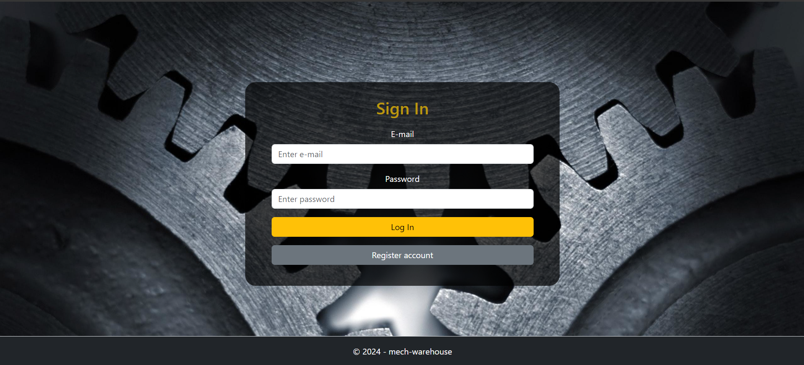
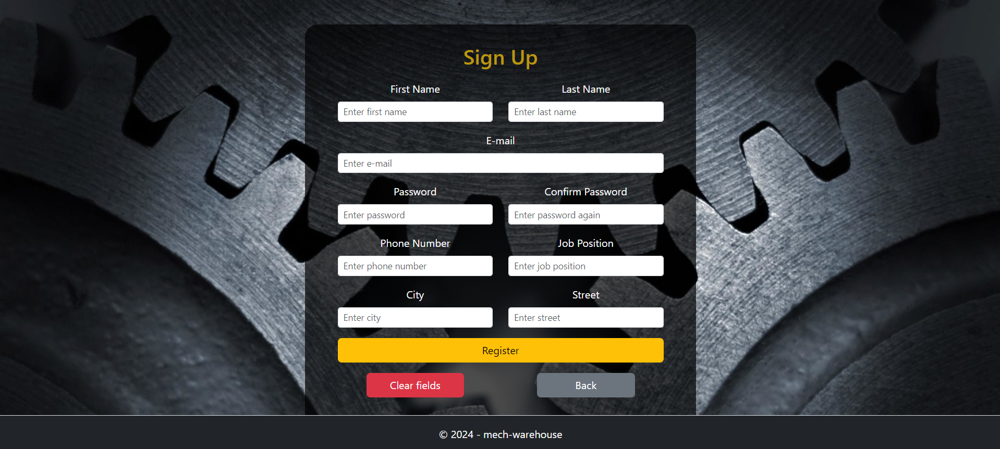
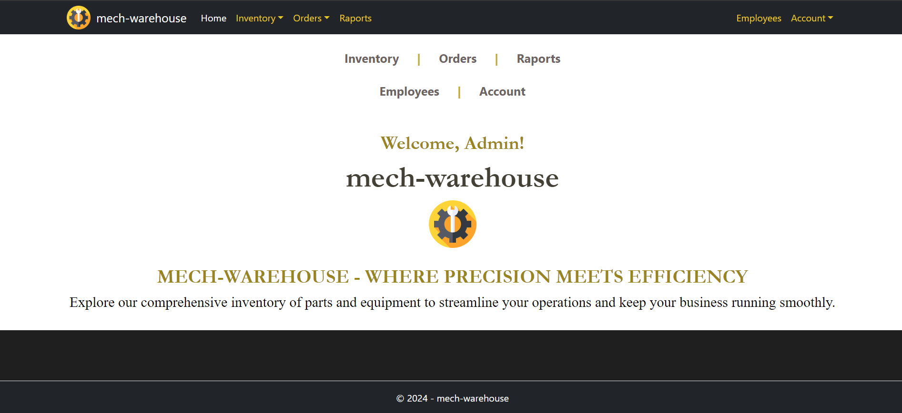
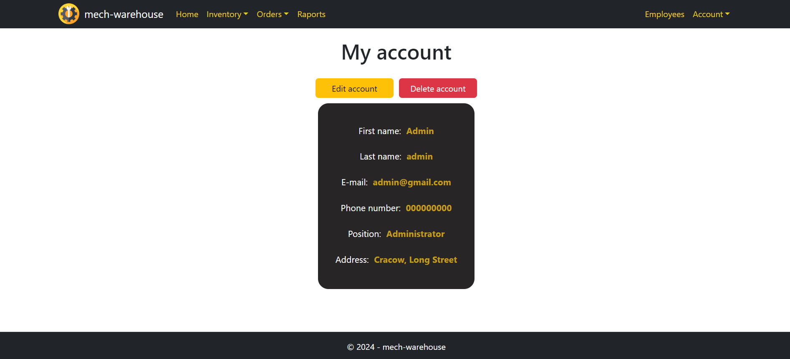
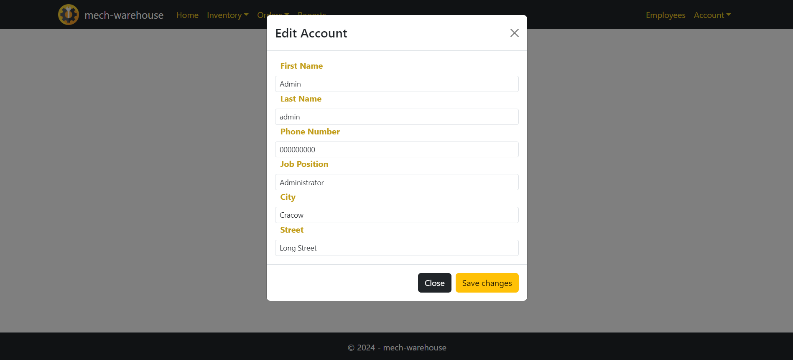

# mech-warehouse [ IN DEVELOPMENT PHASE ]

## About project
The project is a web application presenting a warehouse system for mechanics.

## Technologies
- b a c k e n d:
  - **ASP.NET Core Web API**
    - REST API
  - **C#**
  - ORM: **Entity Framework Core**
  - Database: **Microsoft SQL Server**
- f r o n t e n d:
  - **React**
    - TypeScript

## Example Images

